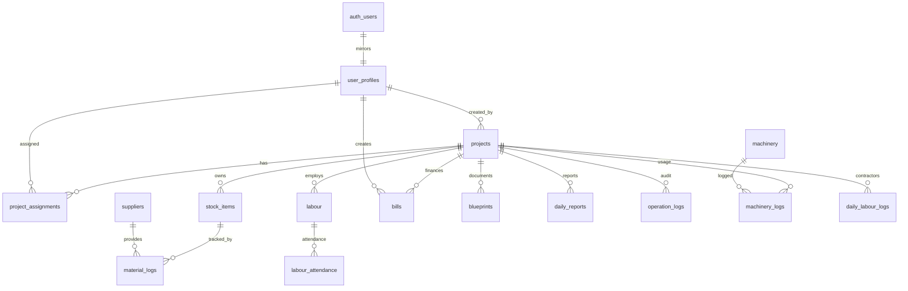

Detected Entities Summary

Tables: user_profiles; projects; project_assignments; stock_items; material_logs; labour; labour_attendance; machinery; machinery_logs; bills; blueprints; daily_reports; operation_logs; suppliers; daily_labour_logs.
Foreign Keys (high level):
user_profiles.id → auth.users(id) ON DELETE CASCADE
projects.created_by → user_profiles(id)
project_assignments.project_id → projects(id) ON DELETE CASCADE; user_id → user_profiles(id) ON DELETE CASCADE; assigned_by → user_profiles(id)
stock_items.project_id → projects(id) ON DELETE CASCADE; created_by → auth.users(id)
material_logs.project_id → projects(id) ON DELETE CASCADE; item_id → stock_items(id) ON DELETE CASCADE; logged_by → auth.users(id) ON DELETE SET NULL; supplier_id → suppliers(id) ON DELETE SET NULL
labour.project_id → projects(id) ON DELETE CASCADE; created_by → auth.users(id)
labour_attendance.labour_id → labour(id) ON DELETE CASCADE; project_id → projects(id) ON DELETE CASCADE; recorded_by → auth.users(id)
machinery.current_project_id → projects(id); created_by → user_profiles(id)
machinery_logs.project_id → projects(id) ON DELETE CASCADE; machinery_id → machinery(id) ON DELETE CASCADE; logged_by → user_profiles(id)
bills.project_id → projects(id) ON DELETE CASCADE; created_by/approved_by/raised_by → user_profiles(id)
blueprints.project_id → projects(id) (cascade ensured in 003); uploader_id → auth.users(id) ON DELETE SET NULL
daily_reports.project_id → projects(id); created_by → user_profiles(id)
operation_logs.user_id → auth.users(id) ON DELETE SET NULL; project_id → projects(id) ON DELETE CASCADE
suppliers.created_by → auth.users(id)
daily_labour_logs.project_id → projects(id) ON DELETE CASCADE; created_by → user_profiles(id)
RLS policies (final active, grouped):
user_profiles: Users can view own profile; Admins can view all profiles; Users or admins can insert profile; Users can update own profile; Admins can update any profile; Super admins can delete profiles.
projects: Admins can view all projects (deleted_at IS NULL); Site managers can view assigned projects (deleted_at IS NULL); Admins can create projects; Admins can update projects; Super admins can delete projects.
project_assignments: Users can view own assignments; Admins can view all assignments; Admins can manage assignments (ALL).
stock_items: Admins can manage stock; Site managers can view project stock; add; update; delete (project-based).
material_logs: Admins can manage material logs; Site managers can view/add/update/delete project material logs.
labour: Admins can manage labour; Site managers can view/add/update/delete project labour.
labour_attendance: Admins can manage attendance; Site managers can view/add/update/delete project attendance.
machinery: Everyone can view machinery; Admins can manage machinery.
machinery_logs: Admins can manage all machinery logs; Site managers can view project machinery logs; Site managers can create project machinery logs.
bills: Admins can manage all bills; Site managers can view project bills; create project bills; update own pending bills.
blueprints: Admins can manage blueprints; Site managers can view assigned project blueprints (non-admin_only).
daily_reports: Site managers (or admins) can manage reports for assigned projects (ALL).
operation_logs: Admins can view all; Site managers can view assigned project logs; Users can create operation logs.
suppliers: Admins can manage suppliers; Site managers can view suppliers (active); Site managers can add suppliers.
daily_labour_logs: Site managers (or admins) can manage project labour logs (ALL).
Storage buckets + policies:
avatars (public): public SELECT; users upload/update own avatar (path first segment = auth.uid()).
blueprints (public=true): policies from 010 — blueprints_read_assigned (SELECT if admin or assigned); blueprints_upload_assigned (INSERT); blueprints_delete_admin (DELETE admin-only); blueprints_update_admin (UPDATE admin-only). Older 003 policies (Admins upload/delete; Project members view) still present → duplicates.
receipts (private): authenticated can SELECT and INSERT (no project scoping).
bills bucket: policies (read/upload/delete/update) added in 010 for admin or assigned via path project_id, but bucket itself never created.
A. System Overview
Architecture (ER)

mirrors
created_by
has
assigned
owns
tracked_by
provides
employs
attendance
finances
creates
documents
reports
audit
usage
logged
contractors
auth_users
user_profiles
projects
project_assignments
stock_items
material_logs
suppliers
labour
labour_attendance
bills
blueprints
daily_reports
operation_logs
machinery_logs
machinery
daily_labour_logs
Role-based access (matrix)
super_admin = full control; admin = manage all tables, approve bills, manage storage; site_manager = limited to assigned projects; anon = none; service_role = bypass RLS (server-side only).
B. Database Inventory (per public table)
user_profiles
Purpose: Local profile & role mirror of auth.users.
Columns: id UUID PK FK auth.users; email TEXT; role TEXT NOT NULL default site_manager (enum super_admin/admin/site_manager); full_name TEXT; phone TEXT; avatar_url TEXT; company_id UUID; created_at/updated_at TIMESTAMPTZ default now.
Constraints: PK id; role check; FK to auth.users ON DELETE CASCADE.
FKs: none other.
Indexes: idx_user_profiles_role, idx_user_profiles_role_created, idx_user_profiles_email, idx_user_profiles_company.
Triggers: update_user_profiles_updated_at; on_auth_user_created (handle_new_user).
RLS: enabled.
Policies: see summary.
Data flow: created by signup trigger; admins may insert/update others; used by role helper functions.
Common queries:
Get current user profile: select * from user_profiles where id = auth.uid();
List site managers: select * from user_profiles where role='site_manager';
Promote to admin: update user_profiles set role='admin' where id=:uid;
Common bugs/fixes: missing profile due to trigger failure; duplicate role checks; ensure auth.users row exists before insert.
projects
Purpose: Core project record; parent for all operational data.
Columns: id UUID PK; name TEXT; description TEXT; location TEXT; status TEXT default planning (enum); start_date DATE; end_date DATE; budget NUMERIC(15,2); client_name TEXT; project_type TEXT enum; progress INT 0–100 default 0; created_by UUID FK user_profiles; created_at/updated_at TIMESTAMPTZ default now; deleted_at TIMESTAMPTZ.
Constraints: status check; project_type check; progress check.
FKs: created_by → user_profiles.
Indexes: idx_projects_status, idx_projects_created_at, idx_projects_created_by, idx_projects_cursor, idx_projects_status_created, idx_projects_client_name, idx_projects_project_type, idx_projects_deleted_at, idx_projects_not_deleted.
Triggers: update_projects_updated_at; trigger_log_project_changes (logs status/create).
RLS: enabled.
Policies: admin select/insert/update; site_manager select assigned; super_admin delete.
Data flow: admins create; assignments grant visibility; downstream tables reference project_id.
Common queries:
Project list for manager: select p.* from projects p join project_assignments pa on pa.project_id=p.id where pa.user_id=auth.uid() and p.deleted_at is null;
Update progress: select update_project_progress(:pid,:progress);
Soft delete: select soft_delete_project(:pid);
Common bugs: missing deleted_at filter in client; assignment cache errors; ensure NOTIFY pgrst after schema change.
project_assignments
Purpose: Maps users to projects and roles.
Columns: id UUID PK; project_id UUID NOT NULL; user_id UUID NOT NULL; assigned_role TEXT default manager enum; assigned_at TIMESTAMPTZ default now; assigned_by UUID; unique(project_id,user_id).
FKs: project_id → projects cascade; user_id/assigned_by → user_profiles.
Indexes: idx_project_assignments_user_id; idx_project_assignments_project_id; idx_project_assignments_composite; idx_assignments_user_project_role.
RLS: enabled.
Policies: users view own; admins view/manage all.
Data flow: admins assign; used by most RLS checks.
Queries:
Assign user: insert into project_assignments(project_id,user_id,assigned_role,assigned_by) values (:p,:u,'manager',auth.uid());
List members: select * from project_assignments where project_id=:p;
Bugs: duplicate unique conflicts; missing assignment blocks site_manager access.
stock_items
Purpose: Master inventory per project.
Columns: id UUID PK; name; description; category; unit default 'units'; quantity NUMERIC; min_quantity NUMERIC; low_stock_threshold NUMERIC default 10; unit_price NUMERIC; project_id UUID; created_by UUID; created_at/updated_at TIMESTAMPTZ.
FKs: project_id → projects cascade; created_by → auth.users.
Indexes: idx_stock_items_project; idx_stock_project; (from 007,011,013).
Triggers: update_stock_items_updated_at.
RLS: enabled.
Policies: admin all; site_manager view/add/update/delete when assigned to project.
Data flow: created from stock screen; material_logs reference item_id.
Queries:
Low stock: select * from stock_items where project_id=:p and quantity<=low_stock_threshold;
Increment quantity: select update_stock_quantity(:item_id, :qty, 'add');
Bugs: project_id nullable → risk of cross-project leakage; enforce NOT NULL recommended.
material_logs
Purpose: Movement logs (inward/outward) per stock item/project.
Columns: id UUID PK; project_id UUID; item_id UUID; log_type TEXT ('inward','outward'); quantity NUMERIC>0; activity TEXT; challan_url TEXT; logged_by UUID; logged_at TIMESTAMPTZ default now; notes TEXT; created_at TIMESTAMPTZ default now; supplier_id UUID.
FKs: project_id → projects cascade; item_id → stock_items cascade; logged_by → auth.users; supplier_id → suppliers set null.
Indexes: idx_material_logs_project; idx_material_logs_item; idx_material_logs_type; idx_material_logs_supplier.
RLS: enabled.
Policies: admin all; site_manager view/add/update/delete by project.
Data flow: created from material receive/issue screens; feeds project stats.
Queries:
Recent issues: select * from material_logs where project_id=:p and log_type='outward' order by logged_at desc limit 20;
Supplier history: select * from material_logs where supplier_id=:s order by logged_at desc;
Bugs: ensure item.project_id matches log.project_id (missing FK check) — add check/fk in fix pack.
labour
Purpose: Workers per project.
Columns: id UUID PK; name; phone; skill_type; daily_wage NUMERIC; project_id UUID; status TEXT enum; created_by UUID; created_at/updated_at TIMESTAMPTZ.
FKs: project_id → projects cascade; created_by → auth.users.
Indexes: idx_labour_project; idx_labour_status.
Triggers: update_labour_updated_at.
RLS: enabled.
Policies: admin all; site_manager view/add/update/delete for assigned project.
Data flow: created by site manager; attendance & bills may use.
Queries:
Active labour count: select count(*) from labour where project_id=:p and status='active';
Wage lookup: select id,name,daily_wage from labour where project_id=:p;
Bugs: missing project_id NOT NULL; no unique phone constraint.
labour_attendance
Purpose: Daily attendance per labour.
Columns: id UUID PK; labour_id UUID; project_id UUID; date DATE; status enum; hours_worked NUMERIC; notes; recorded_by UUID; created_at TIMESTAMPTZ; unique(labour_id,date).
FKs: labour_id → labour cascade; project_id → projects cascade; recorded_by → auth.users.
Indexes: idx_attendance_project_date; idx_attendance_labour.
RLS: enabled.
Policies: admin all; site_manager view/add/update/delete for assigned project.
Data flow: site managers log daily; feeds reports/payroll.
Queries:
Attendance for date: select * from labour_attendance where project_id=:p and date=:d;
Absences: select * from labour_attendance where project_id=:p and status='absent';
Bugs: no constraint tying labour.project_id to attendance.project_id.
machinery
Purpose: Fleet master; may be shared across projects.
Columns: id UUID PK; name; type; registration_no UNIQUE; current_reading NUMERIC; total_hours NUMERIC; status enum (active/maintenance/idle/retired); purchase_date DATE; last_service DATE; current_project_id UUID; created_by UUID; created_at/updated_at TIMESTAMPTZ.
FKs: current_project_id → projects; created_by → user_profiles.
Indexes: idx_machinery_status.
RLS: enabled.
Policies: Everyone can view machinery; Admins can manage machinery.
Data flow: admins register machinery; assignment via current_project_id; logs recorded in machinery_logs.
Queries:
Available machines: select * from machinery where status='active' and current_project_id is null;
In-use on project: select * from machinery where current_project_id=:p;
Bugs: open SELECT to all authenticated users (not project-scoped); no FK enforcement to ensure logs match current_project_id.
machinery_logs
Purpose: Usage/reading logs per project & machine.
Columns: id UUID PK; project_id UUID; machinery_id UUID; work_activity TEXT; start_reading NUMERIC; end_reading NUMERIC; execution_hours generated; notes; logged_by UUID; logged_at TIMESTAMPTZ; created_at TIMESTAMPTZ.
FKs: project_id → projects cascade; machinery_id → machinery cascade; logged_by → user_profiles.
Indexes: idx_machinery_logs_project; idx_machinery_logs_machinery; idx_machinery_logs_date.
RLS: enabled.
Policies: admin all; site_manager view/insert for assigned project.
Data flow: site manager logs daily usage; supports cost/time analytics.
Queries:
Recent usage: select * from machinery_logs where project_id=:p order by logged_at desc limit 20;
Hours by machine: select machinery_id,sum(execution_hours) from machinery_logs where project_id=:p group by machinery_id;
Bugs: no update/delete policy for site_manager; select not filtered by current_project_id of machinery.
bills
Purpose: Expenses/invoices per project.
Columns: id UUID PK; project_id UUID NOT NULL; title TEXT; description; amount NUMERIC; bill_type TEXT check ('workers','materials','transport','equipment_rent','expense','income','invoice'); status TEXT default pending; bill_date DATE default today; due_date DATE; vendor_name TEXT; receipt_url TEXT; created_by UUID; approved_by UUID; raised_by UUID; created_at/updated_at TIMESTAMPTZ; payment_type TEXT enum; payment_status TEXT default need_to_pay; approved_at TIMESTAMPTZ.
FKs: project_id → projects cascade; created_by/approved_by/raised_by → user_profiles (created_by/approved_by set null on delete).
Indexes: idx_bills_project_id; idx_bills_created_by; idx_bills_status; idx_bills_created_at.
Triggers: trigger_update_project_progress (after ins/upd/del); update_bills_updated_at.
RLS: enabled.
Policies: Admins manage all; Site managers view project; create project; update own pending bills.
Data flow: site manager drafts; admin approves; progress recalculated trigger.
Queries:
Pending bills for project: select * from bills where project_id=:p and status='pending';
Approve bill: update bills set status='approved', approved_by=auth.uid(), approved_at=now() where id=:id;
Bugs: raised_by nullable; no DELETE policy; bill storage bucket missing.
blueprints
Purpose: Metadata for stored files per project/folder.
Columns: id UUID PK; project_id UUID NOT NULL; folder_name TEXT NOT NULL; file_name TEXT NOT NULL; file_path TEXT UNIQUE NOT NULL; is_admin_only BOOLEAN DEFAULT false; uploader_id UUID; created_at TIMESTAMPTZ NOT NULL DEFAULT now(); deleted_at TIMESTAMPTZ.
FKs: project_id → projects (cascade); uploader_id → auth.users set null.
Indexes: blueprints_file_path_unique; idx_blueprints_project_id; idx_blueprints_folder; idx_blueprints_cursor; idx_blueprints_project_folder_created; idx_blueprints_not_deleted; idx_blueprints_uploader_id.
RLS: enabled.
Policies: Admins manage all; Site managers can SELECT non-admin files for assigned projects. (No insert/update for site managers → upload fails unless service role.)
Triggers: update_blueprints_updated_at (from 001); trigger_log_blueprint_upload (fixed 025).
Data flow: upload writes storage + row; currently requires admin because of missing insert policy.
Queries:
List folder: select * from blueprints where project_id=:p and folder_name=:f and deleted_at is null;
Soft delete suggestion: use deleted_at filter.
Bugs: migration 010 references missing column uploaded_by; missing INSERT policy for site managers; project_id not enforced NOT NULL in older defs.
daily_reports
Purpose: Daily site report per project/day.
Columns: id UUID PK; project_id UUID NOT NULL; report_date DATE DEFAULT today; weather; work_summary; issues; tomorrow_plan; labour_count INT default 0; status TEXT default pending; created_by UUID; created_at/updated_at TIMESTAMPTZ.
Constraints: unique(project_id, report_date); status check.
FKs: project_id → projects; created_by → user_profiles.
Indexes: (not defined beyond PK); realtime enabled via publication? (not added).
RLS: enabled; policy “Site managers can manage reports” (ALL) with admin fallback.
Data flow: site managers file daily; used in dashboards.
Queries:
Latest reports: select * from daily_reports where project_id=:p order by report_date desc limit 7;
Mark completed: update daily_reports set status='completed', updated_at=now() where id=:id;
Bugs: created_by may be null; no index on project_id/report_date (recommend).
operation_logs
Purpose: Audit/activity feed.
Columns: id UUID PK; user_id UUID; project_id UUID; operation_type enum; entity_type enum; entity_id UUID; title TEXT; description TEXT; metadata JSONB; created_at TIMESTAMPTZ default now.
Indexes: idx_operation_logs_user; idx_operation_logs_project; idx_operation_logs_created; idx_operation_logs_entity.
RLS: enabled; admins view all; site managers view assigned projects; inserts allowed (user_id=auth.uid or null).
Data flow: triggers (projects, blueprints) and app code.
Queries:
Recent activity: select * from operation_logs where project_id=:p order by created_at desc limit 20;
Bugs: no delete/update policies (intentional); ensure triggers use correct fields after blueprint schema change (fixed 025).
suppliers
Purpose: Vendor master.
Columns: id UUID PK; name TEXT; contact_person; phone; email; address; category enum; notes; is_active BOOLEAN default true; created_by UUID; created_at/updated_at TIMESTAMPTZ.
FKs: created_by → auth.users.
Indexes: idx_suppliers_name; idx_suppliers_category; idx_suppliers_is_active.
Triggers: update_suppliers_updated_at.
RLS: enabled; admin manage; site manager view active / insert.
Data flow: used by material_logs supplier_id.
Queries:
Active suppliers by category: select * from suppliers where is_active and category=:c;
Bugs: no uniqueness constraints; no link to project (shared vendor list).
daily_labour_logs
Purpose: Contractor headcount per day.
Columns: id UUID PK; project_id UUID NOT NULL; contractor_name TEXT; skilled_count INT; unskilled_count INT; log_date DATE default today; notes; created_at TIMESTAMPTZ; created_by UUID.
FKs: project_id → projects cascade; created_by → user_profiles.
Indexes: none (recommend project_id, log_date).
RLS: enabled; Site managers can manage project labour logs (ALL) with admin fallback.
Data flow: site managers record daily contractor presence.
Queries:
Logs for date: select * from daily_labour_logs where project_id=:p and log_date=:d;
Bugs: policy file had typos; final policy ok but duplicates left; no NOT NULL on counts; no updated_at.
C. Relationships & Data Flow (End-to-End)
Project creation → assignment: admin creates project; assigns site managers in project_assignments; RLS grants visibility via assignments.
Materials flow: stock_items (per project) created → inward/outward material_logs adjust quantities (update_stock_quantity helper). project_id enforced via RLS; stats via get_project_stats/get_project_material_breakdown.
Machinery usage: machinery assigned via current_project_id; usage recorded in machinery_logs; costs may feed bills (manual).
Labour attendance: labour per project → labour_attendance records daily presence/hours; daily_labour_logs capture contractor counts; reports aggregate via dashboard functions.
Bills: site manager creates pending bill (project-bound); admin approves/updates status/payment; trigger calculate_project_progress updates project progress based on approved/paid expenses.
Expenses analytics: bills feed views v_financial_summary & v_resource_usage and get_financial_metrics; per-project isolation by project_id filter in functions; ensure client passes project_id for site managers.
Reports: daily_reports written by site managers; operation_logs capture activity; dashboards read via get_dashboard_stats/get_recent_activity respecting assignments.
D. Storage (Supabase Buckets)
avatars (public): path user_id/<filename>; public read; user-only upload/update; suited for profile photos.
blueprints (public flag true but protected by RLS): path projectId/folder/file; read/upload allowed for assigned users or admins; delete/update admin-only; recommend private bucket flag + signed URLs.
receipts (private): any authenticated user can read/upload anywhere (no project scoping) — risk.
bills (missing bucket): policies expect path projectId/billId/file; bucket creation absent — fix in SQL pack.
E. Views & Reports
v_financial_summary: monthly totals by project & bill_type for approved/paid bills; per-project isolation via project_id column (caller must filter by RLS).
v_resource_usage: sums approved/paid bills grouped by bill_type per project.
Functions: get_financial_metrics (periodic expense metrics + chart), get_dashboard_stats (activity growth + counts), get_recent_activity, get_active_projects_summary, get_project_stats (two versions exist; latest from 022), get_project_material_breakdown (018), calculate_project_progress trigger.
F. Performance & Data Integrity
Existing indexes cover most join/filter columns; add recommended:
daily_reports: index on (project_id, report_date).
daily_labour_logs: index on (project_id, log_date).
bills: index on (project_id, status, bill_date) for approval queues.
material_logs: partial index per project/log_type if heavy filtering.
Constraints to improve:
Set NOT NULL on project_id for stock_items/material_logs/labour where intended.
Add check to ensure material_logs.project_id matches stock_items.project_id.
Unique constraint for machinery.registration_no already present.
Denormalization: avoid storing totals; rely on logs + views; progress trigger already derived.
Per-project enforcement checklist: every operational table has project_id and RLS uses is_assigned_to_project; exceptions: machinery (global) and suppliers (global) — acceptable but document.
Soft delete: projects.deleted_at and blueprints.deleted_at; ensure queries filter deleted_at using existing partial indexes.
Audit: operation_logs present; ensure all critical writes call log_operation.
G. Security Review
RLS gaps:
blueprints table lacks INSERT/UPDATE for site managers though storage allows upload → insert will fail unless service_role.
machinery SELECT is open to all authenticated users (not project-scoped) — potential overexposure.
receipts bucket allows any authenticated user to upload/read any path (no project scoping).
Bills bucket missing; storage policies dormant.
Over-permissive/mismatched policies: duplicate storage policies (003 + 010) may cause ambiguity; daily_labour_logs has duplicate dropped policies with typos but final ok; machinery_logs lacks update/delete for site managers (admins only).
Functions: many SECURITY DEFINER functions (get_project_stats variants, calculate_project_progress) rely on underlying RLS; ensure they check project assignment explicitly (some do not).
Service role guidance: only server-side jobs should bypass RLS (exports, admin dashboards).

